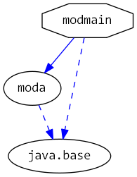

# Java 9 Jigsaw modules example suite
## Example example_addExports_manifest

### Info
Written by [Martin Lehmann](https://github.com/mrtnlhmnn), [Kristine Schaal](https://github.com/kristines) and [Rüdiger Grammes](https://github.com/rgrammes) 

see https://github.com/accso/java9-jigsaw-examples

## What is this example about?

### Modules in this example
* modmain
* modmain has a Main class which is started in run.sh

### Module Dependency Graph, created via [DepVis](https://github.com/accso/java9-jigsaw-depvis)

### Example shows ...
... how to use --add-exports in a manifest file for the Java launcher

We use Add-Exports in the manifest file of modmain to gain access to internal java.base classes (without a command line option)

For this to work
- modmain has to be started as an executable jar
- Add-Exports must be specified in the manifest file of modmain
- modmain has to be in the unnamed module

see: http://mail.openjdk.java.net/pipermail/jpms-spec-experts/2016-September/000391.html
