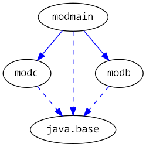

# Java 9 Jigsaw modules example suite
## Example example_annotations

### Info
Written by [Martin Lehmann](https://github.com/mrtnlhmnn), [Kristine Schaal](https://github.com/kristines) and [Rüdiger Grammes](https://github.com/rgrammes).

see https://github.com/accso/java9-jigsaw-examples

## What is this example about?

### Modules in this example
* modb, mod.annotations, modmain
* modmain has a Main class which is started in run.sh

### Module Dependency Graph, created with [DepVis](https://github.com/accso/java9-jigsaw-depvis)

### Example shows modules with annotations
see [ModuleAnnotations](http://openjdk.java.net/projects/jigsaw/spec/issues/#ModuleAnnotations)

- modmain looks up modules modb and mod.annotations and prints their annotations available at runtime
- modb is deprecated via annotation in its module-info.java. 
- mod.annotations defines three annotations with ElementType module, one available at runtime, two only available at compile time
