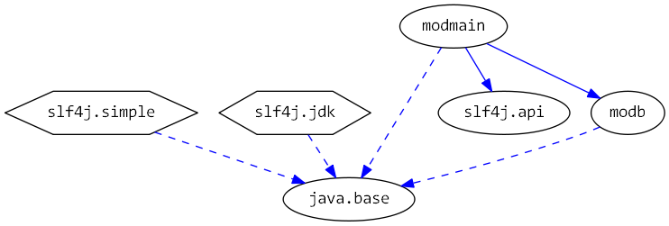

# Java 9 Jigsaw modules example suite
## Example example_automatic-module-logging

### Info
Written by [Martin Lehmann](https://github.com/MartinLehmann1971), [Kristine Schaal](https://github.com/kristines) and [Rüdiger Grammes](https://github.com/rgrammes) 

see https://github.com/accso/java9-jigsaw-examples

## What is this example about?

### Modules in this example
* modb, modmain 
* slf4j*.jar as automatic modules
* modmain has a Main class which is started in run.sh

### Module Dependency Graph, created via [DepVis](https://github.com/accso/java9-jigsaw-depvis)

### Example shows ...
The example illustrates the usage of automatic modules with logging.
We use three logging libs as automatic modules:
* slf4j-api-1.7.12.jar contains the logging interfaces (see directory ifamlib).
* slf4j-jdk14-1.7.12.jar and slf4j-simple-1.7.12.jar contain implementations for slf4j (see directory amlib).

The main class writes some logging output.
The run script runs the main class twice, once with slf4j-jdk14 as implementation, once with slf4j-simple-1.7.12 as implementation.

The example also shows:
* during compile time, only the interfaces are needed 
* the mapping of names in automatic modules: The part behind the last "-" is interpreted as version and cut off. Each remaining "-" is substituted by a ".".
