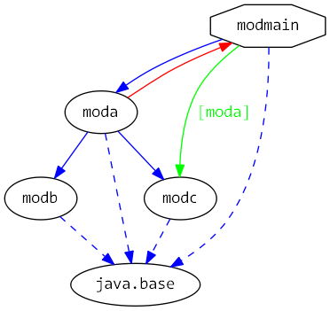
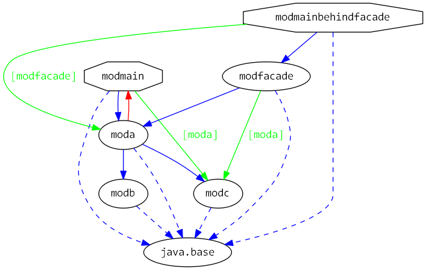

# Java 9 Jigsaw modules example suite
## Example example_gradle-project

### Info
Written by [Martin Lehmann](https://github.com/MartinLehmann1971), [Kristine Schaal](https://github.com/kristines) and [Rüdiger Grammes](https://github.com/rgrammes) 

see https://github.com/accso/java9-jigsaw-examples

## What is this example about?

### Modules in this example
* moda, modb, modc, modfacade, modmain, modmainbehindfacade
* modmain has a Main class which is started in run.sh

This example has the same content like https://github.com/accso/java9-jigsaw-examples/example_requires_exports_requires-transitive_exports-to
The only difference is that this example here is built with Gradle.

### Module Dependency Graph, created via [DepVis](https://github.com/accso/java9-jigsaw-depvis)
without facade modules

withfacade modules

### Example shows ...
... how to build a multi-module application with Gradle 4.2.1 (including clean, build, test, run). 

### See also
https://dzone.com/articles/state-of-gradle-java-9-support?edition=334728
https://guides.gradle.org/building-java-9-modules/
