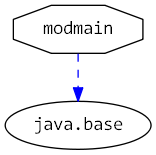

# Java 9 Jigsaw modules example suite
## Example example_hiddenmain

### Info
Written by [Martin Lehmann](https://github.com/MartinLehmann1971), [Kristine Schaal](https://github.com/kristines) and [Rüdiger Grammes] (https://github.com/rgrammes) 

see https://github.com/accso/java9-jigsaw-examples

## What is this example about?

### Modules in this example
* modb, modmain
* modmain has a Main class which is started in run.sh

### Module Dependency Graph, created via [DepVis](https://github.com/accso/java9-jigsaw-depvis)

### Example shows ...
- Can a Java application start with a non-exported main method?
- Run starts two examples: One starts the main methode in an exported package, second calls a main method in a non-exported package

Both calls are possible.
