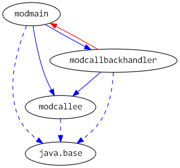

# Java 9 Jigsaw modules example suite
## Example example_interface-callback

### Info
Written by [Martin Lehmann](https://github.com/MartinLehmann1971), [Kristine Schaal](https://github.com/kristines) and Rüdiger Grammes.

see https://github.com/accso/java9-jigsaw-examples

## What is this example about?

### Modules in this example
* modcallbackhandler, modcallee, modmain
* modmain has a Main class which is started in run.sh

### Module Dependency Graph, created via [DepVis](https://github.com/accso/java9-jigsaw-depvis)

### Example shows ...
TODO

- Aufruf von Callback-Schnittstellen

Modul modcallee definiert ein Callback-Interface ICallback, das beim Methodenaufruf von Callee.doIt() mitgegeben wird. 
In der Methode Callee.doIt() wird das Callback-Interface aufgerufen.

Modul modcallbackhandler implementiert ICallback

Modul modmain bringt Callee und Implementierung zusammen. Callee kann die Implementierung von ICallback aufrufen
END TODO
