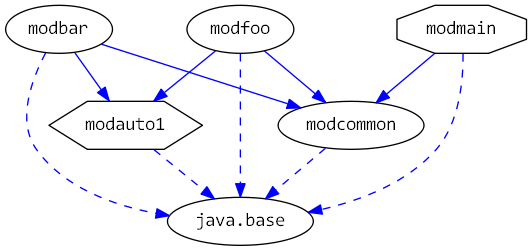

# Java 9 Jigsaw modules example suite
## Example example_layer-all-modules-in-boot-layer

### Info
Written by [Martin Lehmann](https://github.com/mrtnlhmnn), [Kristine Schaal](https://github.com/kristines) and [Rüdiger Grammes](https://github.com/rgrammes) 

see https://github.com/accso/java9-jigsaw-examples

## What is this example about?

### Layers in this example
Only the standard boot layer, which has all modules.

### Modules in this example
- `modcommon` which has standard functionality used by all other modules
- `modauto1` representing a third party library (in version V1)
- `modbar` which requires automatic module `modauto1`
- `modfoo` which requires automatic module `modauto1`
- `modmain` which does reflective calls to `modbar` and `modfoo`

### Module Dependency Graph, created with [DepVis](https://github.com/accso/java9-jigsaw-depvis)
 

### Example shows ...
The examples shows what happens, if `modmain/pkgmain.Main` does reflective calls to classes in module `modfoo` or `modbar`, respectively.
All takes place in the boot layer, as the output of `modcommon/pkgcommon.LayerPrinter` shows.

So all modules `modmain`, `modcommon`, `modfoo`, `modbar` are in the same layer, in the standard boot layer.

As `modmain` does not require `modfoo` and `modbar`, we have to specify `--add-modules modbar,modfoo` in the run script `run.sh`.
