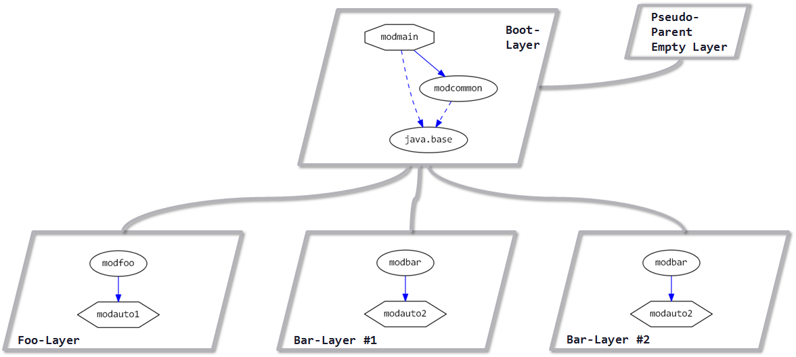

# Java 9 Jigsaw modules example suite
## Example example_layer-modules-grouped-in-hierarchy

### Info
Written by [Martin Lehmann](https://github.com/MartinLehmann1971), [Kristine Schaal](https://github.com/kristines) and [Rüdiger Grammes](https://github.com/rgrammes) 

see https://github.com/accso/java9-jigsaw-examples

## What is this example about?
This example is the same as [this example](https://github.com/accso/java9-jigsaw-examples/example_layer-all-modules-in-boot-layer).
The main difference is, that the modules are not all in the boot layer but distributed over a layer hierarchy of the boot layers and 3 child layers.

### Layers in this example
We have the boot layer as the parent layer for these three child layers:
- `foo layer #1` which contains the module `modfoo` which requires the automatic module `modauto1`
- `bar layer #1` which contains the module `modbar` which requires the automatic module `modauto2`
- `bar layer #2` which contains the module `modbar` which requires the automatic module `modauto2`

The boot layer contains these modules
- `modcommon` which has standard functionality used by all other modules
- `modmain` which does reflective calls to `modbar` and `modfoo`

### Module Dependency Graph, created via [DepVis](https://github.com/accso/java9-jigsaw-depvis)
 

Note that this graph has been changed manually as [DepVis](https://github.com/accso/java9-jigsaw-depvis) cannot deal with layers for now.

### Example shows ...
The examples shows what happens, if `modmain/pkgmain.Main` does reflective calls to classes in module `modfoo` or `modbar`, respectively.
Note that these reflective calls from `modmain` to `modfoo` and `modbar` are done from the boot layer to one of its child layers.

More remarks:
- Reflective calls from the parent layer (from `modmain` to `modfoo` and `modbar`) are possible.
- Reflective calls from the parent layer (`modfoo` and `modbar` to `modcommon`) would also be possible.
- `modcommon` is used from `modmain` and `modfoo` and `modbar`. So it is resolved in the boot layer already.
- The child layers do not have a split package problem, though in `bar layer #1` and `bar layer #2` the same module `modbar` is resolved.
- Also `modbar` and `modfoo` can use different version of the automatic module `modauto1|2`. No split package problem.

The interesting parts are all done in [`modmain/pkgmain.Main` here in this example](https://github.com/accso/java9-jigsaw-examples/example_layer-modules-grouped-in-hierarchy/src/modmain/pkgmain/Main.java). See its functionality on
- ... how to create child layers and add modules
- ... how to call functionality in child layers

You might also want to look at the differences between [`modmain/pkgmain.Main` here in this example](https://github.com/accso/java9-jigsaw-examples/example_layer-modules-grouped-in-hierarchy/src/modmain/pkgmain/Main.java) and
[`modmain/pkgmain.Main` in this example example_layer-all-modules-in-boot-layer](https://github.com/accso/java9-jigsaw-examples/example_layer-all-modules-in-boot-layer/src/modmain/pkgmain/Main.java).
