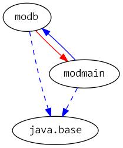

# Java 9 Jigsaw modules example suite
## Example example_reflection

### Info
Written by [Martin Lehmann](https://github.com/MartinLehmann1971), [Kristine Schaal](https://github.com/kristines) and [Rüdiger Grammes] (https://github.com/rgrammes) 

see https://github.com/accso/java9-jigsaw-examples

## What is this example about?

### Modules in this example
* modb, modmain
* modmain has a Main class which is started in run.sh

### Module Dependency Graph, created via [DepVis](https://github.com/accso/java9-jigsaw-depvis)

### Example shows ...
Before J9 build b136, there was a difference between `exports` and `exports dynamic`. In our example we've had a difference between the (exported) package `pkgb` with class `B` and the (non-exported) package `pkgbinternal` with class `InternalB`. 

In modmain, we call methods of both classes statically (only B) and dynamically via reflection (`B` and `InternalB`), with variants of methods (public, private, private static methods) are all called via reflection. In the `module-info` of `modb` there is no more distinction possible, both exports are `exports private`.
