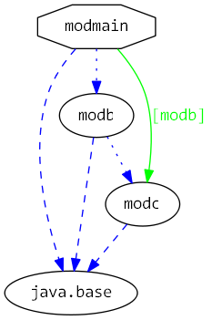

# Java 9 Jigsaw modules example suite
## Example example_requires_exports

### Info
Written by [Martin Lehmann](https://github.com/mrtnlhmnn), [Kristine Schaal](https://github.com/kristines) and [Rüdiger Grammes](https://github.com/rgrammes) 

see https://github.com/accso/java9-jigsaw-examples

## What is this example about?

### Modules in this example
* modb, modc, modmain
* modmain has a Main class which is started in run.sh
* Note the explicit --add-modules option to make sure that modb and modc are available (otherwise you will see: `Exception in thread "main" java.lang.NoClassDefFoundError: pkgb/B`)

### Module Dependency Graph, created with [DepVis](https://github.com/accso/java9-jigsaw-depvis)

### Example shows ...
- Usage of `requires static` and `requires static transitive` for optional dependencies for modules, needed at compile time but don’t want to force its presence at runtime. So we mark such a dependency as being optional with the `static` modifier.
 
