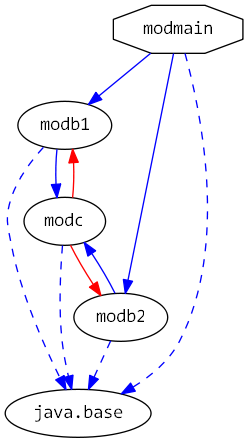

# Java 9 Jigsaw modules example suite
## Example example_requires_exports-to

### Info
Written by [Martin Lehmann](https://github.com/mrtnlhmnn), [Kristine Schaal](https://github.com/kristines) and [Rüdiger Grammes](https://github.com/rgrammes) 

see https://github.com/accso/java9-jigsaw-examples

## What is this example about?

### Modules in this example
* modb1, modb2, modc, modmain
* modmain has a Main class which is started in run.sh

### Module Dependency Graph, created with [DepVis](https://github.com/accso/java9-jigsaw-depvis)

### Example shows ...
- Usage of requires and exports-to
