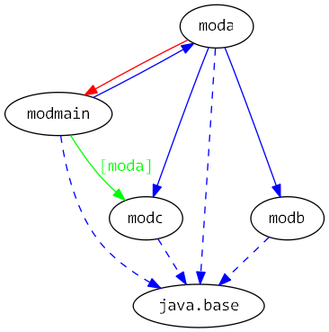
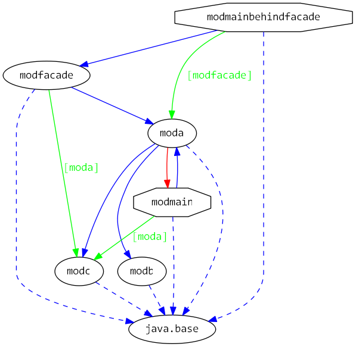

# Java 9 Jigsaw modules example suite
## Example example_requires_exports_requires-transitive_exports-to

### Info
Written by [Martin Lehmann](https://github.com/MartinLehmann1971), [Kristine Schaal](https://github.com/kristines) and [Rüdiger Grammes](https://github.com/rgrammes) 

see https://github.com/accso/java9-jigsaw-examples

## What is this example about?

### Modules in this example
* moda, modb, modc, modfacade, modmain, modmainbehindfacade
* modmain has a Main class which is started in run.sh

### Module Dependency Graph, created via [DepVis](https://github.com/accso/java9-jigsaw-depvis)
without facade modules

withfacade modules

### Example shows ...
- Usage of requires
- Usage of exports
- Usage of requires transitive
- Usage of exports to
