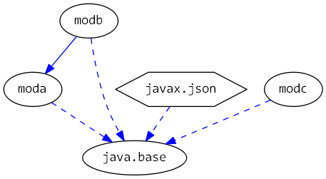

# Java 9 Jigsaw modules example suite
## Example example_resolved-modules

### Info
Written by [Martin Lehmann](https://github.com/mrtnlhmnn), [Kristine Schaal](https://github.com/kristines) and [Rüdiger Grammes](https://github.com/rgrammes) 

see https://github.com/accso/java9-jigsaw-examples

## What is this example about?

### Modules in this example
* TODO
* modmain has a Main class which is started in run.sh

### Module Dependency Graph, created via [DepVis](https://github.com/accso/java9-jigsaw-depvis)

### Example shows ...
TODO

Beispiel fuer 
- resolvedmods: Was wird geladen?

Module moda, modb (requires moda), modc

Die Main-Methode in jedem Module gibt die Module im Boot-Layer aus:
- moda/pkga.AMain: Der Boot-Layer enthaelt java., jdk. und moda
- modb/pkgB.BMain: Der Boot-Layer enthaelt java., jdk., moda, modb
- modc/pkgC.CMain: Der Boot-Layer enthaelt java., jdk., modc
- modb/pkgb.BMain mit --add-modules modc: Der Boot-Layer enthaelt java., jdk., moda, modb, modc

Obwohl nur java.base required wird, werden einige java.*-Module geladen (java.rmi, java.scripting, java.logging, ...)

--
Ein Automatic-Module wird nur geladen, wenn es auch required wird. Es wird zuerst die Konfiguration anhand der 
required-Beziehungen erstellt, dann werden die Read-Edges fuer automatische Module ergaenzt. 

Siehe dazu auch "State of the Module System":
      *After* a module graph is resolved, therefore, an automatic module  
      is made to read every other named module, whether automatic or explicit.

END TODO
