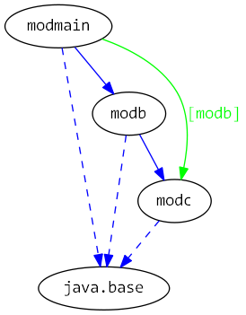

# Java 9 Jigsaw modules example suite
## Example example_resources

### Info
Written by [Martin Lehmann](https://github.com/MartinLehmann1971), [Kristine Schaal](https://github.com/kristines) and [Rüdiger Grammes](https://github.com/rgrammes) 

see https://github.com/accso/java9-jigsaw-examples

## What is this example about?

### Modules in this example
* modb, modc, modmain
* modmain has a Main class which is started in run.sh

### Module Dependency Graph, created via [DepVis](https://github.com/accso/java9-jigsaw-depvis)

### Example shows resources handling in Java 9 Jigsaw modules
see [ResourceEncapsulation](http://openjdk.java.net/projects/jigsaw/spec/issues/#ResourceEncapsulation)

* modb and modc both have their own resources.properties.
* They can access it via Module.getResourceAsStream()
* Note that modb/pkgb.B *can* also access the resources file in modc
