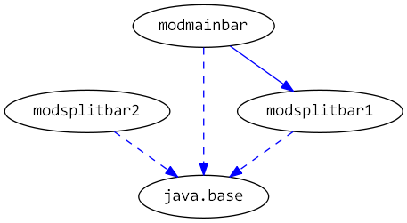

# Java 9 Jigsaw modules example suite
## Example example_splitpackage

### Info
Written by [Martin Lehmann](https://github.com/MartinLehmann1971), [Kristine Schaal](https://github.com/kristines) and [Rüdiger Grammes] (https://github.com/rgrammes) 

see https://github.com/accso/java9-jigsaw-examples

## What is this example about?

### Modules in this example
* modb, modmain, modmainbar, modsplitbar1, modsplitbar2, modmainfoo, modsplitfoo1, modsplitfoo2
* modmain has a Main class which is started in run.sh

### Module Dependency Graph, created via [DepVis](https://github.com/accso/java9-jigsaw-depvis)

### Example shows ...
Case 1)
* modsplitfoo1 adn modsplitfoo2 do both contain a package called pkgfoo.
* modmainfoo requires modsplitfoo1 und modsplitfoo2
Does not compile! A module must not requires 2 or more modules, which have/export the same package

Case 2) 
* modsplitbar1 and modsplitbar2 do both contain a package called pkgbar.
* modmainbar requires modsplitbar1
* During runtime, --add-modules is used to load also modsplitbar2
Shows a runtime exception: In one classloader, 2 or more modules must not be loaded, which have/export the same package.

### TODOs
- [ ] Does case 2 work, if the classloader for modsplitbar1 and modsplitbar2 is different (i.e. what about layers)?
