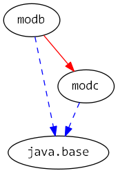

# Java 9 Jigsaw modules example suite
## Example example_unnamed-module-reflection-illegal-access

### Info
Written by [Martin Lehmann](https://github.com/mrtnlhmnn), [Kristine Schaal](https://github.com/kristines) and [Rüdiger Grammes](https://github.com/rgrammes) 

see https://github.com/accso/java9-jigsaw-examples

## What is this example about?

### Modules in this example
- The unnamed module (i.e. the classpath) and "normal" modules modb and modc.
- modb is accesses from the unnamed module. 
- modc is not really relevant but only needed to allow a class in modb to be exported-to only to modc.

### Module Dependency Graph, created with [DepVis](https://github.com/accso/java9-jigsaw-depvis)

### Example shows ...
The usage of the Java command line option `--illegal-access`, aka the "kill switch". See [Java9 Maillinglist](http://mail.openjdk.java.net/pipermail/jigsaw-dev/2017-May/012673.html) for details.

Four classes on the classpath, i.e. in the unnamed module, access other classes with reflective access.
- `cpmain/pkgcpmain.MainCallingJavaBaseJDKInternal.java` does reflective access to a class from module `java.base`, package `jdk.internal` (a package which is new in Java9). An explicit `--add-opens` is hence needed.
- `cpmain/pkgcpmain.MainCallingJavaBaseSunIO.java`       does reflective access to a class from module `java.base`, package `sun.io` (a package which has existed before, in Java8). The kill-switch `--illegal-access=permit` will hence work.
- `cpmain/pkgcpmain.MainCallingJavaDesktop.java`         does reflective access to a class from module `java.desktop`, package `com.sun.java.swing.plaf.nimbus.NimbusLookAndFeel` (a package which has existed before, in Java8). The kill-switch `--illegal-access=permit` will hence work.
- `cpmain/pkgcpmain.MainCallingJavaBaseModB.java`        does reflective access to a class from module `modb` (a package which has not existed before Java9). An explicit `--add-opens` is hence needed.

*Note that the kill switch **only works for classes which had been available before Java9**, i.e. were part of Java8. See also explanation [here](https://docs.oracle.com/javase/9/tools/java.htm#JSWOR624).*

See all 20 different variants of how to use the `--illegal-access=...` command line option or the `--add-opens` option in the run script `run.sh`.
Note that these 20 variants have not been copied redundantly to Eclipse launch files.
