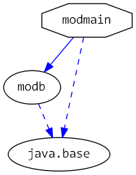

# Java 9 Jigsaw modules example suite
## Example example_unnamed-module_access-from-explicit-module

### Info
Written by [Martin Lehmann](https://github.com/mrtnlhmnn), [Kristine Schaal](https://github.com/kristines) and [Rüdiger Grammes](https://github.com/rgrammes) 

see https://github.com/accso/java9-jigsaw-examples

## What is this example about?

### Modules in this example
* modb, modmain, and also classes for the unnamed module (cpb)
* modmain contains a Main class which is started in run.sh

### Module Dependency Graph, created via [DepVis](https://github.com/accso/java9-jigsaw-depvis)

### Example shows ...
The examples illustrates the accessibility rules access to the classpath (i.e. from an explicit module on the module-path to the unnamed module) with reflective access:
- Reflective access from a module to the classpath works, as reflection has implicit readability (no --add-reads modmain=ALL-UNNAMED necessary)
- Note also that the `Main` class in `modmain` cannot access any package on the classpath if an explicit module like `modb` has such a package exported. This is here the case for `pkgb`. The module `modmain` cannot access the class `pkgb.BFromClasspath` because it is "covered" ("hidden") by code in `modb`! This is also the case for reflective access.

The script run.sh starts the main class from `modmain`.
