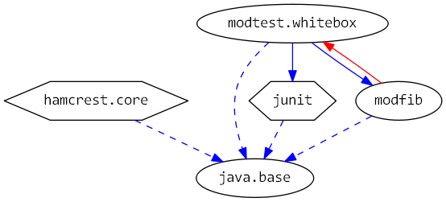

# Java 9 Jigsaw modules example suite
## Example example_whitebox-test-exports

### Info
Written by [Martin Lehmann](https://github.com/MartinLehmann1971), [Kristine Schaal](https://github.com/kristines) and Rüdiger Grammes.

see https://github.com/accso/java9-jigsaw-examples

## What is this example about?

### Modules in this example
* modfib, modtest.whitebox
* modmain has a Main class which is started in run.sh

### Module Dependency Graph, created via [DepVis](https://github.com/accso/java9-jigsaw-depvis)

### Example shows ...

Example for Whitebox Testing, using a separate module for the whitebox tests and "exports to" (static and dynamic) to give test classes access to the module internal code.
- all.sh only runs the example with static exports to.
- to run it with exports during startup, 
  1) in modfib, copy module-info-without-exports-to.java.mv to module-info .java (or just remove exports... to in the module-info.java)
  2) run all-with-addExports.sh instead if all.sh
  
Disadvantages:
* exports to in the module-info means a static export (of internal classes) to the test code. 
* Using the --add-export option in the compile and run scripts leads to bad maintainability (the compile and run scripts need to be maintained in addition to the code)

### See also 
Example [example_test](../example-test)
